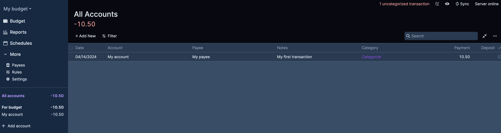

[](https://codecov.io/github/bvanelli/actualpy)

# actualpy

Python API implementation for Actual server.

[Actual Budget](https://actualbudget.org/) is a superfast and privacy-focused app for managing your finances.

> **WARNING:** The [Javascript API](https://actualbudget.org/docs/api/) to interact with Actual server already exists,
> and is battle-tested as it is the core of the Actual frontend libraries. If you intend to use a reliable and well
> tested library, that is the way to go.

# Installation

Install it via Pip using the repository url:

```bash
pip install git+https://github.com/bvanelli/actualpy.git
```

# Basic usage

The most common usage would be downloading a budget to more easily build queries. This would you could handle the
Actual database using SQLAlchemy instead of having to retrieve the data via the export. The following script will print
every single transaction registered on the Actual budget file:

```python
from actual import Actual
from actual.queries import get_transactions

with Actual(
    base_url="http://localhost:5006",  # Url of the Actual Server
    password="<your_password>",  # Password for authentication
    encryption_password=None,    # Optional: Password for the file encryption. Will not use it if set to None.
    file="<file_id_or_name>",  # Set the file to work with. Can be either the file id or file name, if name is unique
    data_dir="<path_to_data_directory>"  # Optional: Directory to store downloaded files. Will use a temporary if not provided
) as actual:
    transactions = get_transactions(actual.session)
    for t in transactions:
        account_name = t.account.name if t.account else None
        category = t.category.name if t.category else None
        print(t.date, account_name, t.notes, t.amount, category)
```

## Adding new transactions

After you created your first budget (or when updating an existing budget), you can add new transactions by adding them
using the `actual.session.add()` method. You cannot use the SQLAlchemy session directly because that adds the entries to your
local database, but will not sync the results back to the server (that is only possible when re-uploading the file).

The method will make sure the local database is updated, but will also send a SYNC request with the added data so that
it will be immediately available on the frontend:

```python
import decimal
import datetime
from actual import Actual
from actual.queries import create_transaction, create_account

with Actual(base_url="http://localhost:5006", password="mypass", file="My budget") as actual:
    act = create_account(actual.session, "My account")
    t = create_transaction(
        actual.session,
        datetime.date.today(),
        act,
        "My payee",
        notes="My first transaction",
        amount=decimal.Decimal(-10.5),
    )
    actual.commit()  # use the actual.commit() instead of session.commit()!
```

Will produce:



# Experimental features

> **WARNING:** Experimental features do not have all the testing necessary to ensure correctness in comparison to the
> files generated by the Javascript API. This means that this operations could in theory corrupt the data. Make sure
> you have backups of your data before trying any of those operations.

## Bootstraping a new server and uploading a first file

The following script would generate a new empty budget on the Actual server, even if the server was not bootstrapped
with an initial password.

```python
from actual import Actual

with Actual(base_url="http://localhost:5006", password="mypass", bootstrap=True) as actual:
    actual.create_budget("My budget")
    actual.upload_budget()
```

You will then have a freshly created new budget to use:


If the `encryption_password` is set, the budget will additionally also be encrypted on the upload step to the server.

## Updating transactions using Bank Sync

If you have either [goCardless](https://actualbudget.org/docs/advanced/bank-sync/#gocardless-setup) or
[simplefin](https://actualbudget.org/docs/experimental/simplefin-sync/) integration configured, it is possible to
update the transactions using just the Python API alone. This is because the actual queries to the third-party service
are handled on the server, so the client does not have to do any custom API queries.

To sync your account, simply call the `run_bank_sync` method:

```python
from actual import Actual

with Actual(base_url="http://localhost:5006", password="mypass") as actual:
    synchronized_transactions = actual.run_bank_sync()
    for transaction in synchronized_transactions:
        print(f"Added of modified {transaction}")
    # sync changes back to the server
    actual.commit()
```

## Running rules

You can also automatically run rules using the library:

```python
from actual import Actual

with Actual(base_url="http://localhost:5006", password="mypass", file="My budget") as actual:
    actual.run_rules()
```

You can also manipulate the rules individually:

```python
from actual import Actual
from actual.queries import get_ruleset, get_transactions

with Actual(base_url="http://localhost:5006", password="mypass", file="My budget") as actual:
    rs = get_ruleset(actual.session)
    transactions = get_transactions(actual.session)
    for rule in rs:
        for t in transactions:
            if rule.evaluate(t):
                print(f"Rule {rule} matches for {t}")
```

# Understanding how Actual handles changes

The Actual budget is stored in a sqlite database hosted on the user's browser. This means all your data is fully local
and can be encrypted with a local key, so that not even the server can read your statements.

The Actual Server is a way of only hosting files and changes. Since re-uploading the full database on every single
change is too heavy, Actual only stores one state of the database and everything added by the user via frontend
or via the APIs are individual changes above the base stored database on the server, stored via separate endpoint.
This means that on every change, done locally, a SYNC request is sent to the server with a list of the following string
parameters:

- `dataset`: the name of the table where the change happened.
- `row`: the row identifier for the entry that was added/update. This would be the primary key of the row (a uuid value)
- `column`: the column that had the value changed
- `value`: the new value. Since it's a string, the values are either prefixed by `S:` to denote a string, `N:` to denote
a numeric value and `0:` to denote a null value.

All individual column changes are computed on an insert, serialized with protobuf and sent to the server to be stored.
New clients can use this individual changes to then sync their local copies and add the changes executed on other users.

But this also means that new users need to download a long list of changes, possibly making the initialization slow.
Thankfully, user is also allowed to reset the sync. This would make sure all changes are actually stored in the
database. This is done on the frontend under *Settings > Reset sync*, and causes the current file to be reset (removed
from the server) and re-uploaded again, with all changes already in place. In this case, the sync list of changes is
reset because the server already has the latest version of the database.

This means that, when using this library to operate changes on the database, you have to make sure that either:

- do a sync request is made using the `actual.commit()` method. This only handles pending operations that haven't yet
been committed, generates a change list with them and posts them on the sync endpoint.
- do a full re-upload of the database is done.

# Contributing

The goal is to have more features implemented and tested on the Actual API. If you have ideas, comments, bug fixes or
requests feel free to open an issue or submit a pull request.
