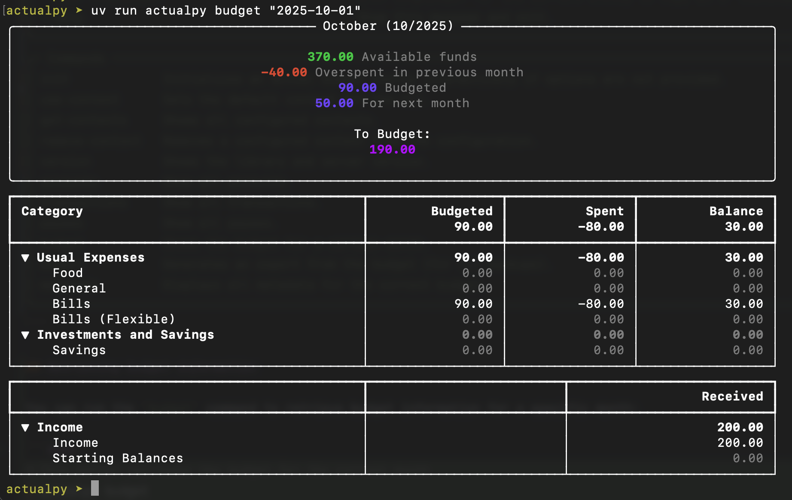

# Command Line Interface

The `actualpy` command line interface (CLI) allows you to interact with your Actual Budget data directly
from the terminal without writing custom scripts.

## Installation

Install the CLI with the optional CLI dependencies:

```bash
pip install "actualpy[cli]"
```

## Initial setup

Before using any commands, you need to initialize a budget configuration:

```console
$ actualpy init
Please enter the URL of the actual server [http://localhost:5006]:
Please enter the Actual server password:
(1) Test
Please enter the budget index: 1
Name of the context for this budget [test]:
Initialized budget 'test'
```

Once initialized, you can export your budget data:

```console
$ actualpy export
Exported budget 'Test' (budget id 'My-Finances-0b46239') to '2024-10-04-1438-Test.zip'.
```

The configuration will be saved on the folder `.actualpy/config.yaml`. Check full help for more details:

```console
$ actualpy --help

 Usage: actualpy [OPTIONS] COMMAND [ARGS]...

╭─ Options ─────────────────────────────────────────────────────────────────────────────────────────────────────────────────────────────────────────╮
│ --output              -o      [table|json]  Output format: table or json [default: table]                                                         │
│ --install-completion                        Install completion for the current shell.                                                             │
│ --show-completion                           Show completion for the current shell, to copy it or customize the installation.                      │
│ --help                                      Show this message and exit.                                                                           │
╰───────────────────────────────────────────────────────────────────────────────────────────────────────────────────────────────────────────────────╯
╭─ Commands ────────────────────────────────────────────────────────────────────────────────────────────────────────────────────────────────────────╮
│ init             Initializes an actual budget config interactively if options are not provided.                                                   │
│ use-context      Sets the default context for the CLI.                                                                                            │
│ get-contexts     Shows all configured contexts.                                                                                                   │
│ remove-context   Removes a configured context from the configuration.                                                                             │
│ version          Shows the library and server version.                                                                                            │
│ accounts         Show all accounts.                                                                                                               │
│ transactions     Show all transactions.                                                                                                           │
│ payees           Show all payees.                                                                                                                 │
│ budget           Shows the budget for a certain month.                                                                                            │
│ export           Generates an export from the budget (for CLI backups).                                                                           │
│ metadata         Displays all metadata for the current budget.                                                                                    │
╰───────────────────────────────────────────────────────────────────────────────────────────────────────────────────────────────────────────────────╯
```

## Retrieving budget information

You can run the `budget` command to retrieve budget information for a specific month:

```bash
# This option retrieves the budget for the current month
$ actualpy budget
# You can also specify a month to retrieve the budget for, using the format YYYY-MM-DD (day is ignored)
$ actualpy budget "2025-10-01"
```

This should output a nicely formatted table with the budget information for the specified month:



If you'd rather want the budget information in JSON format, you can use the `--output json` option:

```bash
# Those two options are equivalent
$ actualpy --output json budget "2025-10-01"
$ actualpy -o json budget "2025-10-01"
```

You can use this in combination with tools like `jq` to extract specific fields from the budget information:

```bash
$ actualpy -o json budget "2025-10-01" | jq -r '.categoryGroups[].categories[] | "\(.name)=\(.budgeted)"'
```

Should output:

```
Food=0.0
General=0.0
Bills=90.0
Bills (Flexible)=0.0
Savings=0.0
Income=0.0
Starting Balances=0.0
```
