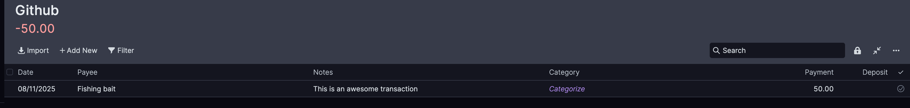

# Listening to changes

Sometimes, it can be useful to listen to changes made on your server, rather than just reading static data.

The following example shows how to add a listener to your Actual server and only listen to changes made to the
budget. We still need to implement a polling rate to listen to the `sync` endpoint, but it should both
update your local budget **and** log the changes to the budget.

First, we have to understand the [Changeset][actual.utils.changeset.Changeset]: it groups together changes made to a
certain resource. It contains which columns were changed, and the new values.

It's important to note that the changeset **does not contain** the original values of the columns, as well as the
information about whether the row is new or updated. It is possible, however, to retrieve this information by loading a
local copy of the database.

The changeset is also only available **from the moment the budget was initialized**.

The changeset can be retrieved via the API call for [Actual.sync][actual.Actual.sync], as a list of changes.
A basic change listener implementation could look like this:

```python
import time
from actual import Actual

def main() -> None:
    with Actual(password="mypass", file="State") as actual:
        # Handle the change listener
        while True:
            changes = actual.sync()
            for change in changes:
                # Implement callback logic here
                print(change)
            time.sleep(5)


if __name__ == "__main__":
    main()
```

We are now going to implement a change handler. A common scenario is reacting to transactions being added to the budget.
To do this, we need to know which transactions were already there when we downloaded the budget, which can be done with
the method [get_transactions][actual.queries.get_transactions].

The next step is to implement the change handler logic. We want to filter everything that is not of type
[Transaction][actual.database.Transactions], and also skip transactions that were modified:

Putting it all together, we have:

```python
import time

from sqlmodel import Session

from actual import Actual, Changeset
from actual.database import Transactions
from actual.queries import get_transactions


def change_handler(
    session: Session, change: Changeset, existing_transactions: set
) -> None:
    # We ignore all changes that are not transactions
    if change.table is not Transactions:
        return
    # If the transaction already exists, we ignore it because it is not new
    if change.id in existing_transactions:
        return
    # Return the transaction object from the database
    changed_obj: Transactions = change.from_orm(session)  # type: ignore
    print(
        f"A new transaction with name '{changed_obj.notes}' "
        f"was added with the amount {changed_obj.get_amount()}"
    )
    # Modify the copy of existing transactions that was passed to the function,
    # so they are ignored in the future
    existing_transactions.add(change.id)


def main() -> None:
    with Actual(password="mypass", file="State") as actual:
        # We create a set of all transactions to avoid processing
        # modifications to existing transactions
        transaction_set = {t.id for t in get_transactions(actual.session)}

        # Handle the change listener
        while True:
            changes = actual.sync()
            for change in changes:
                # Implement callback logic here
                change_handler(actual.session, change, transaction_set)
            time.sleep(5)


if __name__ == "__main__":
    main()
```

Here, we add one transaction to the budget via frontend while the script is running:



The following message will be logged on the console:

```
A new transaction with name 'This is an awesome transaction' was added with the amount -50
```
