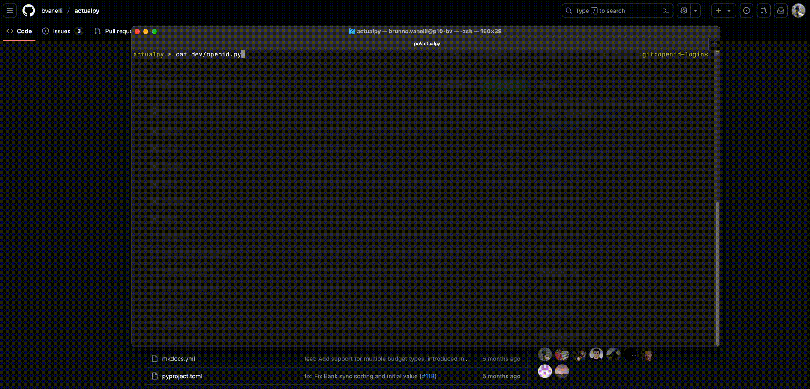

# Log in with OpenID

You can now log in directly using an OpenID login via browser. To do that, initialize your API call without
using a password:

```python
from actual import Actual
from actual import queries

with Actual(file="State") as actual:
    categories = queries.get_categories(actual.session)
    print(f"Categories are: {[c.name for c in categories]}")
```

This will launch a browser as guide you through the login at the provider configured. Afterwards, the token will be
passed to the application without any manual steps:


