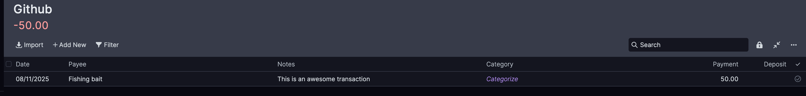

The following example shows how to add a listener to your Actual server and only listen to changes done on the
budget. We still need to implement a pooling rate to listen to the `sync` endpoint, but it should both
update your local budget **and** log the changes to certain variables.

In the example, we set up a callback to listen to all new transactions that are inserted via frontend, and log some
basic information about them.

Here, we add one transaction to the budget via frontend while the script is running:



The following message will be logged on the console:

```
A new transaction with name 'This is an awesome transaction' was added with the amount -50
```
