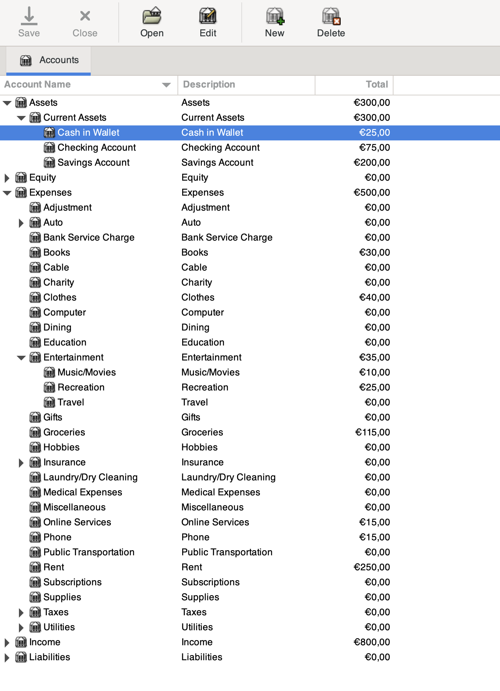
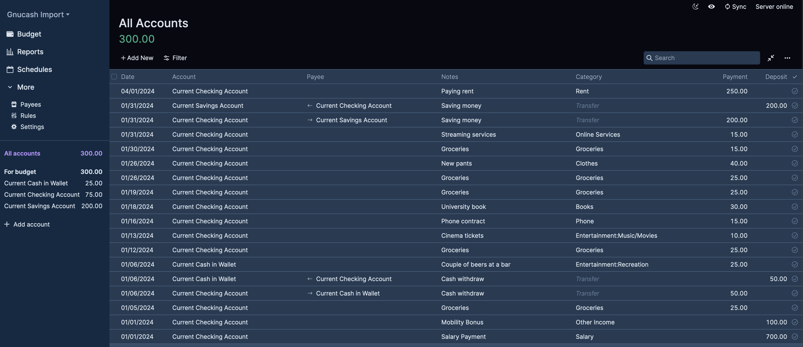

This example shows how to import a Gnucash file using entirely the Python API. It will create the budget from scratch
using the remote migrations, import all transactions and the upload the new budget to the server.

The API, however, only uploads the budget in full, so the partial syncs are not done. If you want to do a partial
update, check the [CSV import example](../csv).

This script requires a custom version of [Piecash](https://github.com/sdementen/piecash) to run that support SQLAlchemy
1.4 and beyond, since it's a requirement for SQLModel. Getting the dependencies to work together can be a little bit
tricky, until Piecash finally supports SQLAlchemy>2.

For the script to work, the Gnucash must be saved first as a sqlite database. This can be done by first opening the
budget, and then using "Save as" and picking the sqlite format.

This example folder already provides one example file to test the script with. Here is a preview from the Gnucash
interface:

And the result afterward being imported:

